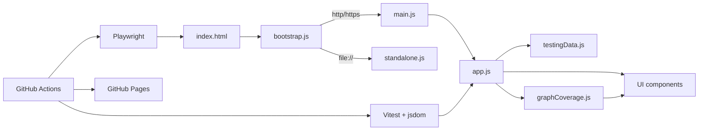

# Software Testing Visualization

[](https://github.com/skhuang/stvisual/actions/workflows/test.yml)
[](https://github.com/skhuang/stvisual/actions/workflows/deploy-pages.yml)
[](https://skhuang.github.io/stvisual/)

An interactive visualization project for software testing concepts, including testing method taxonomy, testing flow, common testing types, and graph coverage analysis.

Live demo: <https://skhuang.github.io/stvisual/>

## Preview


## Why This Project

- Turns software testing concepts into an interactive visual teaching tool
- Demonstrates graph-based coverage criteria with concrete requirements and test paths
- Supports editable graphs so users can see coverage recomputed immediately
- Shows optimization impact by comparing path counts before and after reduction

## Feature Highlights

- Visualizes testing method categories: black-box, white-box, gray-box, and their sub-techniques
- Animates the testing workflow from requirements analysis to defect reporting
- Shows common testing levels: unit, integration, system, and acceptance testing
- Provides graph coverage visualization for:
  - Node Coverage
  - Edge Coverage
  - Prime Path Coverage
  - Edge-Pair Coverage
  - Complete Path Coverage
- Automatically generates test requirements
- Automatically generates test path sets
- Applies a greedy set-cover approximation to reduce the selected test path set
- Displays before/after optimization metrics and saved path count
- Lets users edit the graph structure live with nodes, edges, start node, and end node inputs

## Architecture



## Showcase Notes

- Deployable to GitHub Pages
- Works directly from `file://` by using a standalone fallback bundle
- Includes both unit tests and real browser tests
- Covers the major graph coverage features with automated tests

## Quick Start

### 1. Install dependencies

```bash
npm install
```

### 2. Start the local static server

```bash
npm run serve
```

Default URL: <http://127.0.0.1:4173>

### 3. Open the app directly from the file system

You can also open `index.html` directly.

The app supports two entry modes:
- `http/https`: uses the modular runtime entry
- `file://`: automatically switches to the standalone fallback to avoid module CORS restrictions

## Testing

### Unit tests

```bash
npm run test:run
```

### Browser E2E tests

```bash
npm run test:browser
```

### Browser tests with UI

```bash
npm run test:browser:headed
```

## GitHub Actions

The repository includes two workflow groups:

- `Test`
  - `unit-test`
  - `browser-test`
- `Deploy GitHub Pages`
  - builds the Pages artifact after tests pass
  - deploys the static site to GitHub Pages automatically

Relevant workflow files:
- `.github/workflows/test.yml`
- `.github/workflows/deploy-pages.yml`

## Graph Coverage Focus

The graph coverage section currently supports:

- requirement generation
- test path generation
- approximate minimal test path selection
- live graph editor recomputation
- UI metrics for optimization before and after path reduction

This project is useful for:
- teaching graph coverage concepts
- comparing different coverage criteria
- observing the mapping between requirements and test paths
- demonstrating path reduction with a set-cover style approximation

## GitHub Pages Deployment

To prepare the static site output locally:

```bash
npm run pages:prepare
```

This command:
- regenerates `src/standalone.js`
- builds the `site/` output directory
- prepares the artifact structure used by the GitHub Pages workflow

## Project Structure

```text
.
├── index.html
├── src/
│   ├── app.js
│   ├── bootstrap.js
│   ├── main.js
│   ├── standalone.js
│   ├── data/
│   ├── utils/
│   ├── components/
│   └── tests/
├── e2e/
├── scripts/
└── .github/workflows/
```

## License

No license file is currently included. Add a `LICENSE` file if you want to publish the project under an explicit open-source license.
